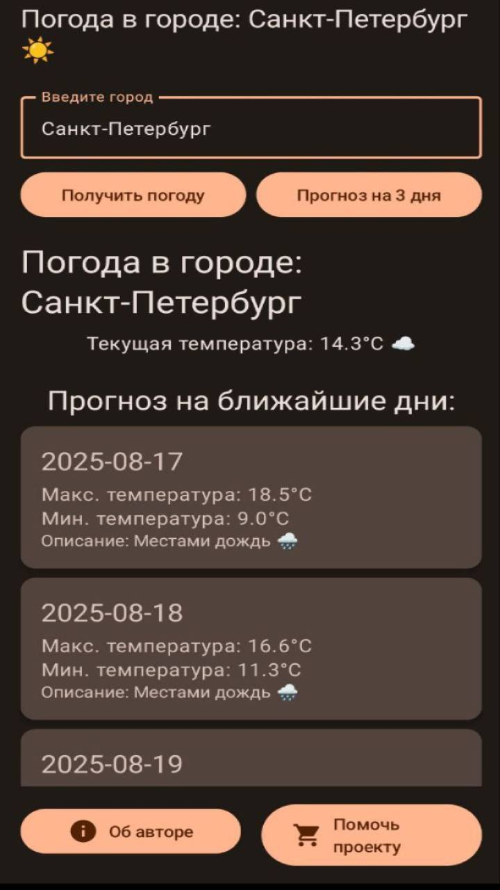

# 🌦️ WeatherApp

Учебное Android-приложение для отображения прогноза погоды.  
Проект создан для практики работы с **Kotlin**, **Android Jetpack**, **WorkManager** и API прогноза погоды.

---

## 📱 Возможности
- Поиск и выбор города для отображения прогноза
- Актуальная информация о погоде (температура, состояние неба, иконки)
- Поддержка русского языка в прогнозе
- Уведомления о погоде (ежедневные напоминания через `WorkManager`)
- Возможность поддержать проект через QR-код в приложении

---

## 🛠️ Технологии
- **Kotlin**
- **MVVM** архитектура
- **ViewBinding / Jetpack**
- **WorkManager** (для ежедневных уведомлений)
- **Retrofit2 / OkHttp3** (для работы с Weather API)
- **Gson** (парсинг JSON)
- **Coroutines + Flow** (асинхронность)
- **Material Design Components**
---
## 📱 Скриншоты
<p float="left">
  
  
  
  
</p>

## ⚡ Установка
1. Склонировать репозиторий:
   ```bash
   git clone https://github.com/username/WeatherApp.git
2. Открыть проект в Android Studio.

3. Добавить API-ключ в файл local.properties:
   WEATHER_API_KEY=ваш_API_ключ
  (ключ можно получить на WeatherAPI.com
   или другом погодном сервисе).
4. Запустить сборку и установить приложение на эмулятор/устройство.

## 📂 Структура проекта
WeatherApp/
├── app/
│   ├── src/
│   │   ├── main/
│   │   │   ├── java/com/example/space_ranger3209/  # основной код приложения
│   │   │   ├── res/                                # ресурсы (иконки, layout’ы, стили)
│   │   │   └── AndroidManifest.xml
│   ├── build.gradle
│   └── ...
├── .gitignore
├── README.md
└── settings.gradle

## 🤝 Поддержка

Если приложение вам понравилось, вы можете поддержать его развитие.
Отсканируйте QR-код прямо из приложения или используйте изображение ниже:
<p align="center">  </p>

##⚠️ Примечание: это учебный проект и не предназначен для продакшн-использования.

## 🚀 Roadmap
- [ ] Виджет погоды на рабочем столе
- [ ] История поиска городов
- [ ] Расширенный прогноз на неделю
- [ ] Поддержка геолокации
- [x] Ежедневные уведомления о погоде  
  
## 🤝 Контрибьюция

Pull request’ы приветствуются!
Перед отправкой PR:

1. Сделайте fork проекта.

2. Создайте ветку: git checkout -b feature/имя-фичи.

3. Внесите изменения и закоммитьте.

4. Отправьте PR.
   
##📜 Лицензия

Проект распространяется под лицензией MIT.
Свободно используйте и модифицируйте для своих целей.